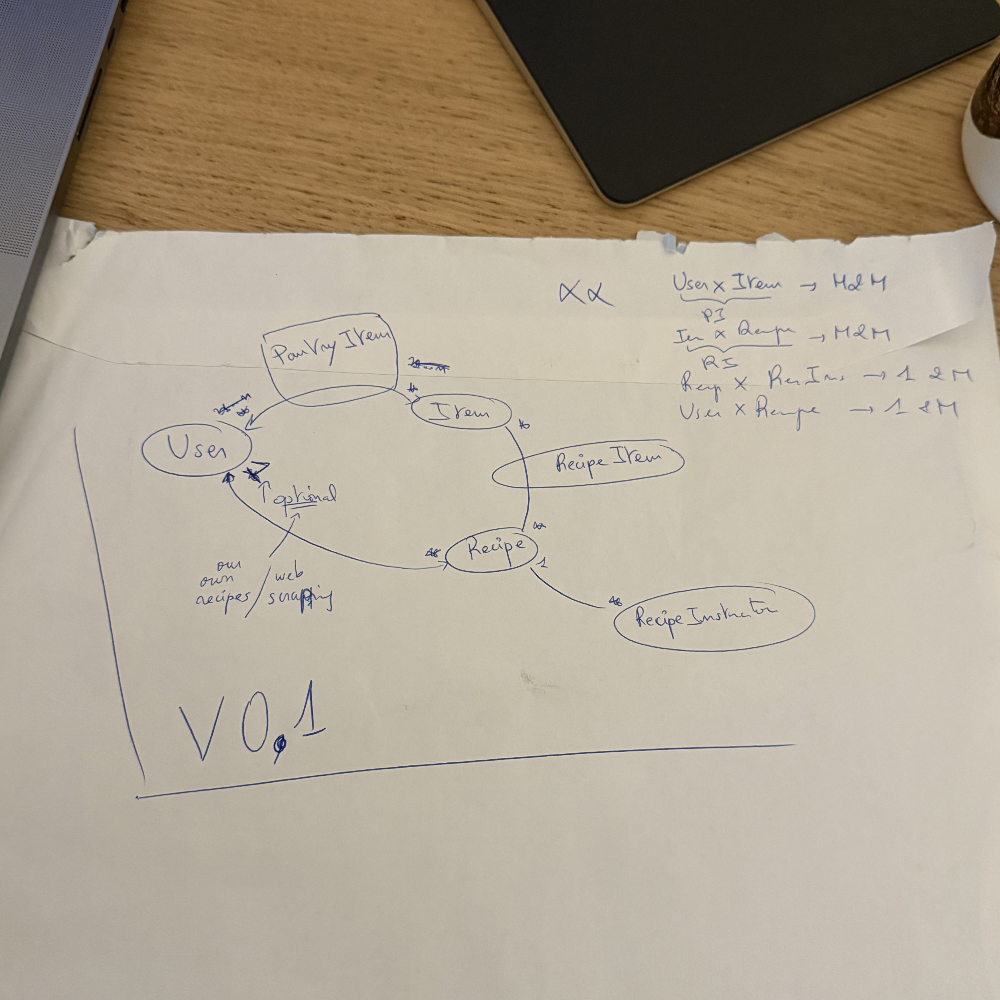

# project-pantry: AHOY!

## Overview
I’ve been struggling to keep track of what’s in my pantry, which inspired me to build a kitchen management app. The goal is to make it easier for people like me to stay organized and reduce food waste. What's very motivating and exciting is how there’s a lot of potential for growth within this idea.

This app could evolve to include features like smart inventory tracking, meal planning, shopping list integration, and even expiration date reminders.

## Table of Contents
- [Goals and Non-Goals](#1-goals-and-non-goals)
- [Requirements](#2-requirements)
- [Architecture / Design](#3-architecture--design)
- [User Stories / Use Cases](#4-user-stories--use-cases)
- [Milestones & Timeline](#5-milestones--timeline)
- [Risks & Assumptions](#6-risks--assumptions)

## 1. Goals and Non-Goals
### Goals
- Manage inventory.
    - Track what's in the pantry, expiration dates and quantities.
- Meal planning.
- Suggest recipes based on available ingredients.
- Suggest recipes based on dietary preferences.
- Smart shopping list integration.
    - Could include product reviews and recommendations based on other users' experiences.

### Non-Goals
- No super fancy AI stuff for now. I want to focus on the features and refine them before including that.

## 2. Requirements
### Functional Requirements
- User authentication
- Managing pantry
    - CRUD operations for items.
    - Cooking a meal, i.e. deducting items from the pantry.
    - Meal planning
        - Suggest recipes based on available ingredients.
        - Calendar integration for the meal plan ?
    - Expiring item notifications.
        - "Use it or lose it" keep users aware of items that are going to expire soon.
        - Could immediately suggest recipes based on the expiring items.
- Shopping list management
    - Create shopping lists based on recipes or pantry needs.
    - Super long term but could include plugs for grocery delivery services.
- Recipe management
    - CRUD operations for recipes.
    - Suggest recipes based on dietary preferences. (not necessarily AI-driven, at least as a start)
        - Should include dietary tags.
        - Should give priority to recipes with ingredients that are expiring soon.
    - Scrape recipes from the web.

### Non-Functional Requirements
- Scalability, performance and availability

## 3. Architecture / Design
### High-Level Architecture
- Frontend
    - iOS app using SwiftUI.
    - Kotlin for Android.
    - Probably something React based or maybe trying out Vue for the web app.
- Backend
    - JS vs Python ?
        - Python could be better if we want to include AI features later on.
        - JS could be better for the web dev ecosystem. (although Python has Django and Flask) (Note to self: look into FastAPI)
    - Idk if REST or something GraphQL.
        - Probably REST for now, tried and tested.
    - PostgreSQL.
- Authentication
    - Auth.js ? Is there an alternative for Python ?
    - OAuth2 for social logins.
    - JWT for session management.

### Models
All models will include an id, is_active, created_at and updated_at fields.
Should the user be able to have multiple pantries? Maybe, but for now I’ll keep it simple and just have one pantry per user.

- User
    - username
    - email
    - password_hash
- Item
    - name
    - description
    - image_url
    - time_to_expire (timestamp | null if not perishable)
    - is_generic
- PantryItem: linked to PantryItem and User
    - quantity
    - unit
    - notes ? Could be interesting to make this an embedded JSON field for flexibility.
- Recipe
    - name
    - description
    - time_to_cook
    - servings
    - image_url
    - dietary_tags (e.g. vegan, gluten-free, etc.)
- RecipeItem: linked to Recipe and PantryItem
    - quantity
    - unit
    - notes ?
- RecipeInstruction: linked to Recipe
    - step_number
    - instruction_text
    - media_url (optional, for images or videos)
- Tag
    - name
    - description
    - is_dietary (boolean, to differentiate between dietary tags and other tags)

Marvel at this diagram (already outdated, but you get the picture):

## 4. User Stories / Use Cases
### General Stories
As a user I want to be able to:
- [ ] create an account.
- [ ] log in to my account.
- [ ] log out of my account.
- [ ] reset my password.
- [ ] update my profile information.
- [ ] delete my account.
- [ ] change my settings.

### Pantry Management Stories
As a user I want to be able to:
- [ ] add items to my pantry.
- [ ] remove items from my pantry.
- [ ] update items in my pantry.
- [ ] quickly update my items quantities in my pantry.

### Recipe Management Stories
As a user I want to be able to:
- [ ] add recipes to my collection.
- [ ] remove recipes from my collection.
- [ ] update recipes in my collection.
- [ ] search for recipes based on ingredients I have.
- [ ] cook a recipe, meaning I automatically update the used ingredients with the remaining quantities after cooking.

## 5. Milestones & Timeline
For now as long as effort is put into the project, I’m happy. I’m not in a rush to finish it, but I do want to make progress.

### Phase 1: MVP
The bare minimum for me to actually be able to use this app in my daily life. This helps me stay motivated to keep working on it and also gives me a chance to become my own user and see what works and what doesn't.

This phase should include:
- Authentication
- Basic pantry management
    - CRUD operations for items.
    - Cooking a meal, i.e. deducting items from the pantry.
- Basic recipe management
- Basic meal planning
    - Suggest recipes based on available ingredients.

UI should be simple and functional, nothing fancy yet. I want the focus to be on the functionality and UX.

#### Phase N: TBD
TBD

## 6. Risks & Assumptions
### Risks
- Users might forget to update their pantry after using items... Maybe add a “cook meal” flow that updates it for them.

### Assumption
- Users will manually input items, at least at first, think about how tedious that might be and how you can ease it (barcode scan, photos, etc. later).
